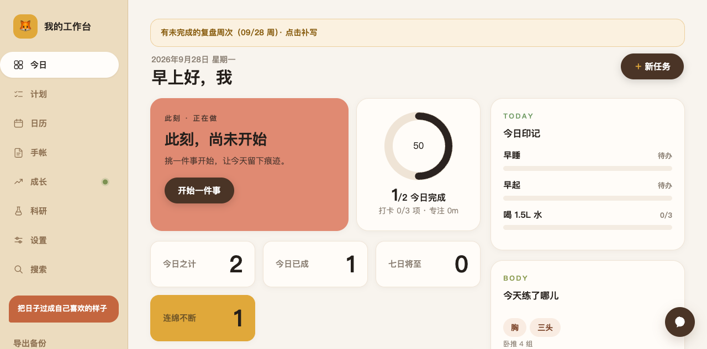
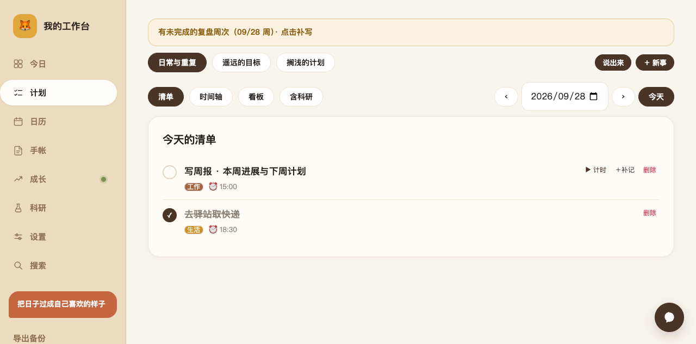
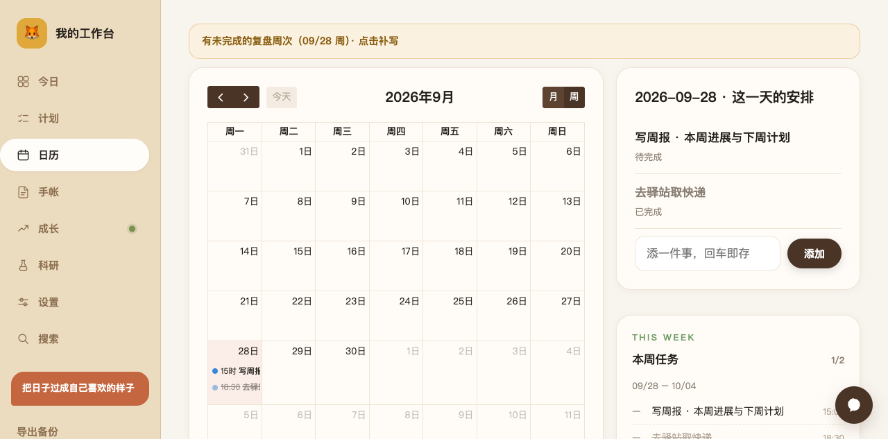
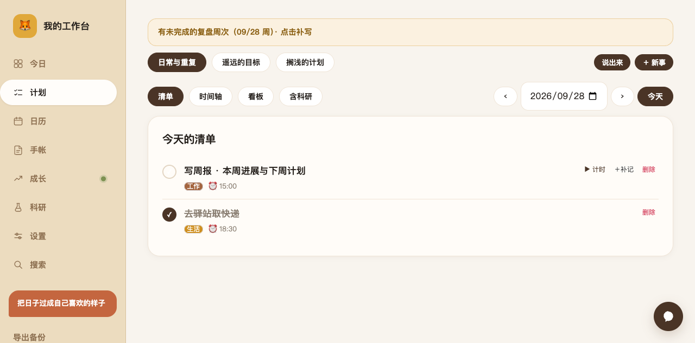
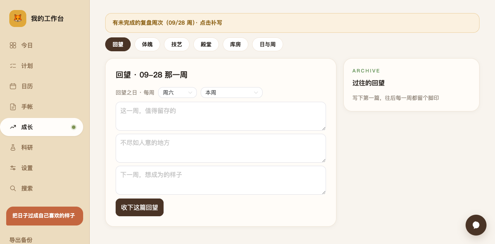
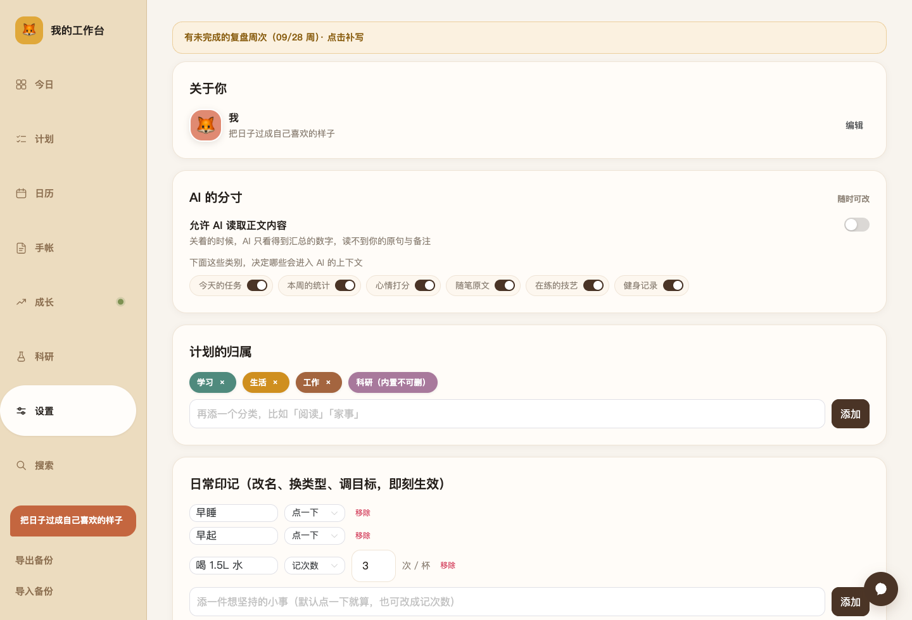
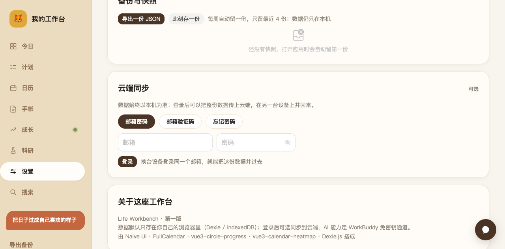
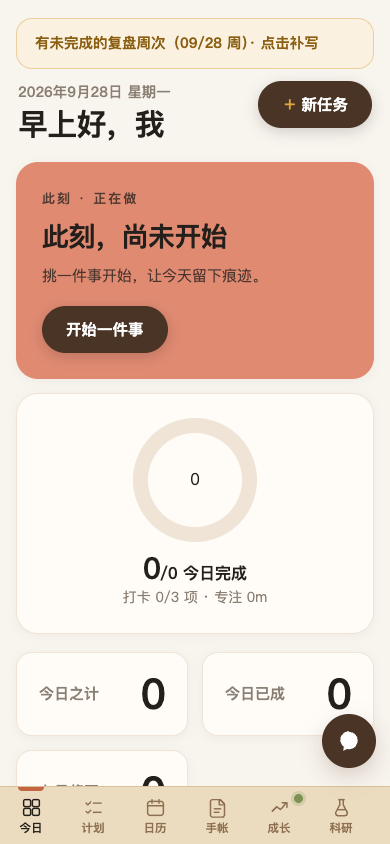

<div align="center">

# 个人工作台 · Life Workbench

**数据存在你自己浏览器里的个人工作台。**
待办、日历、打卡、复盘、科研、成就、资产库，一页一页长出来的生活秩序。



<sub>纯前端 · 本地优先 · 可离线 · 可选接大模型与云同步</sub>

</div>

---

## 这是什么

一个给自己用的个人工作台。它不追求"什么都能做"，只想把一个人日常真正会反复做的事做顺：今天要干什么、这个月排了什么、最近有没有在坚持、这一周过得怎么样、那个想法后来去哪了。

几个设计取向，决定了它长成这样：

- **本地优先**：所有数据先写进浏览器的 IndexedDB，不登录、不联网也能完整使用。云端同步是后加的、可关掉的选项，不是前提。
- **不做每日总结**：日报只给模板，需要"被说说"的是每周复盘。少一点打扰。
- **AI 只在它真能加分的环节出现**：语音说一句拆成任务、把随笔改得更顺、每周给一条建议、每天挑三条见闻。其余地方不硬塞 AI。
- **界面安静**：无渐变、无玻璃拟态、无装饰性插图，暖色纸感，内容用真实数据填满。

## 功能一览

| 模块 | 能做的事 |
| --- | --- |
| **今日** | 问候与日期、正在做的一件事、今日印记（打卡）、今日之计 / 今日已成 / 七日将至、连续天数、AI 见闻（每天 6 条） |
| **计划** | 日常与重复 / 遥远的目标 / 搁浅的计划三条线；清单、双时间轴、看板、甘特四种视图；计时与补时、deadline 紧急度、重复规则（每天 / 仅工作日 / 每周几 / 每隔几天）；**语音「说出来」一句话拆成多条任务**；移动端左滑完成、长按编辑 |
| **日历** | 月视图与周视图、节假日与调休角标（holiday-cn，离线缓存）、选中日的安排、本周任务、即将到来的事 |
| **手账** | 碎碎念（可让 AI 改写，原文与 AI 版二选一）、每日一句、打卡热力图 |
| **成长** | 复盘（复盘日可自定、错过会提示补写历史周）、日报 / 周报模板、技能、健身打卡、成就殿堂、长期资产库 |
| **科研** | 项目 / 方向 / 笔记 / 心得，独立成区、不混进资产库，日程并入总日历 |
| **全局** | 命令面板 `Cmd/Ctrl + K`、操作撤销条、六类内容全局搜索、模块显隐与拖拽排序、导出 / 导入备份、每周本地快照、PWA 可安装可离线 |

## 界面

**今日**：左边是此刻该做的一件事，中间的圈是今天的完成度，右边是打卡与实际记录 —— 全部来自真实数据，不摆装饰。


**计划**：同一个清单可以切成清单 / 时间轴 / 看板 / 甘特四种看法。点「说出来」对着说话，一句话拆成多条任务，落库前每条都能改。



**日历**：月周日三层，节假日与调休角标直接标在格子上，右侧是选中那天的安排和本周全貌。



**手账**：碎碎念与打卡热力图放在一起 —— 今天写了什么、这个月坚持得怎么样，一眼看完。



**成长**：复盘、报告、技能、健身、成就殿堂、长期资产库都在这里，按周为节奏。



**设置**：AI 的分寸（可以逐项决定哪些内容允许 AI 读）、分类、打卡项、数据导出与快照。



**云同步（可选）**：邮箱登录后可以把整份数据传上云端、在另一台设备并回来。数据始终以本机为准，不登录不影响任何功能。



**移动端**：窄屏自动切换成底部导航 + 卡片单列，左右边缘横滑切换相邻模块。



## 快速开始

需要 Node.js 18 以上（开发环境用 22 验证）。

```bash
git clone https://github.com/<你的用户名>/<仓库名>.git
cd life-workbench
npm install
npm run dev
```

打开终端里提示的地址（默认 `http://localhost:5173`）。首次进入会自动写入默认分类与打卡项，可以直接开始用。

构建与预览：

```bash
npm run build     # 产出 dist/，同时生成 Service Worker
npm run preview   # 本地起一个静态服务预览构建结果
```

部署就是把 `dist/` 丢到任意静态托管（Vercel、Netlify、Cloudflare Pages、对象存储 + CDN 都行）。注意两点：

- 需要 **HTTPS**，否则 Service Worker 与语音识别不可用。
- 如果做客户端路由的深层链接，把 404 回退到 `index.html`。

## 装成应用（不用每次开浏览器）

它就是标准的 PWA，装完之后有自己的图标、独立窗口、能离线打开。

**手机**

- iPhone：用 Safari 打开站点 → 分享 → **添加到主屏幕**，弹窗里选「**作为网页 App 打开**」
- Android：用 Chrome 打开 → 右上角菜单 → **安装应用**

**电脑**

- Chrome：地址栏右侧的安装图标，或菜单 → 投放、保存和共享 → **安装为应用**
- Edge：菜单 → 应用 → **安装此站点为应用**
- Safari（macOS 14+）：文件 → **添加到程序坞**

**macOS 上想做成独立的 .app**

也可以自己封装一个：在 `/Applications` 里建一个 bundle（`Contents/Info.plist` + `Contents/MacOS/launcher` + `Contents/Resources/icon.icns`），launcher 里用 `chrome --app=<站点地址> --window-size=1280,880` 启动。这样做的好处是**复用你现有 Chrome 的用户数据**，打开就是原来那份数据、登录态也在，不用重新同步；代价是运行时 Dock 里显示的是 Chrome 的图标。

> 手机装成网页 App 后注意：iOS 上网页 App 的存储与 Safari 是**分开**的，第一次打开会是空的 —— 登录云端并回一次即可，之后它独立运行。

## 可选：接入 AI 与云同步

**不配置也能用**，只是没有这些能力：语音拆任务、随笔润色、AI 小助手、每周建议、每日 AI 见闻、多设备同步。其余功能完全不受影响。

配置方式：

```bash
cp .env.example .env.local
# 编辑 .env.local，填入你自己的两个值
```

```ini
VITE_WB_ENDPOINT=https://<你的应用>.app.workbuddy.host
VITE_WB_PUBLISHABLE_KEY=<你自己的 publishableKey>
```

这两个值在 WorkBuddy 里为本项目**开通云服务**后由平台下发，功能包括大模型调用、云数据库、用户认证。

> `publishableKey` 是设计上可放在前端的公开标识（服务端还按 Origin 校验、数据表还有行级权限兜底），但它绑定到你的应用 —— **请务必换成你自己的**。本仓库不含任何真实凭据，`.env.local` 也已在 `.gitignore` 里。

云同步用的是"一人一份全量快照"的极简模型，需要两张表。若你的云环境还没有，可以执行：

<details>
<summary>建表 SQL（点击展开）</summary>

```sql
-- 每人一份全量数据快照：只有本人能读写自己那一行
CREATE TABLE wb_snapshots (
  id BIGINT GENERATED ALWAYS AS IDENTITY PRIMARY KEY,
  owner_id TEXT NOT NULL UNIQUE DEFAULT auth.uid(),
  payload JSONB NOT NULL,
  tables_count INTEGER,
  rows_count INTEGER,
  device TEXT,
  updated_at TIMESTAMPTZ NOT NULL DEFAULT now(),
  created_at TIMESTAMPTZ NOT NULL DEFAULT now()
);
ALTER TABLE wb_snapshots ENABLE ROW LEVEL SECURITY;
GRANT SELECT, INSERT, UPDATE, DELETE ON TABLE public.wb_snapshots TO authenticated, anon;

CREATE POLICY wb_snapshots_select_own ON wb_snapshots FOR SELECT TO authenticated, anon USING (owner_id = auth.uid());
CREATE POLICY wb_snapshots_insert_own ON wb_snapshots FOR INSERT TO authenticated, anon WITH CHECK (owner_id = auth.uid());
CREATE POLICY wb_snapshots_update_own ON wb_snapshots FOR UPDATE TO authenticated, anon USING (owner_id = auth.uid()) WITH CHECK (owner_id = auth.uid());
CREATE POLICY wb_snapshots_delete_own ON wb_snapshots FOR DELETE TO authenticated, anon USING (owner_id = auth.uid());
```

</details>

如果还想用「每日 07:00 预抓 AI 见闻」（把当天见闻提前抓好放进云端，首屏直接读，不用等外链），再加一张公开只读的表：

<details>
<summary>见闻表 SQL（点击展开）</summary>

```sql
-- 每天一行，前端只读；写入交给定时任务
CREATE TABLE wb_news (
  id BIGINT GENERATED ALWAYS AS IDENTITY PRIMARY KEY,
  day TEXT NOT NULL UNIQUE,
  items JSONB NOT NULL,
  ai_brief TEXT,
  built_at TIMESTAMPTZ NOT NULL DEFAULT now()
);
ALTER TABLE wb_news ENABLE ROW LEVEL SECURITY;
GRANT SELECT ON TABLE public.wb_news TO authenticated, anon;
CREATE POLICY wb_news_read_all ON wb_news FOR SELECT TO authenticated, anon USING (true);
```

配套脚本在 `scripts/fetch-news.mjs`，零依赖，跑一次就会输出当天那批见闻的 JSON，交给定时任务写库即可。

</details>

## 数据与隐私

- **数据在哪**：浏览器 IndexedDB，库名 `LifeWorkbench`，22 张表。文件系统里没有任何用户数据文件。
- **默认零上传**：不配置上面的环境变量时，除了「每日见闻」（只向 Hacker News 与 GitHub 的公开接口取标题，不携带任何个人信息）以外，应用不发任何请求。
- **云同步是 opt-in**：表的行级权限按 `auth.uid()` 限制，别人即使拿到你的 `publishableKey` 也读不到你的数据；且服务端会校验来源域名。同步前会在本机先留一份快照，可以随时「回到那天」。
- **AI 有开关**：设置里的「AI 的分寸」可以逐项决定哪些内容允许 AI 读取（今天的任务 / 每周统计 / 心情分数 / 随笔原文 / 在练的技艺 / 健身记录）。关掉时，AI 只看汇总数字，读不到原文。
- **备份**：设置页可以导出 JSON、也可以把每周快照导回。**导出的备份里是你的真实生活数据，别提交到任何仓库** —— 这也是 `.gitignore` 里拦掉 `*.backup.json` 的原因。

## 技术栈

| 用途 | 选型 |
| --- | --- |
| 框架 | Vue 3（`<script setup>`）+ Vite 6 |
| 本地数据库 | Dexie 4（IndexedDB），带版本迁移 |
| 组件库 | Naive UI（主题变量统一改色） |
| 日历 | FullCalendar 6（daygrid + timegrid + interaction），按需加载 |
| 甘特 | frappe-gantt |
| 图表 | vue3-circle-progress、vue3-calendar-heatmap |
| 交互 | vue-draggable-plus（拖拽排序）、fuse.js（搜索） |
| 时间与重复 | dayjs、rrule |
| 离线 | vite-plugin-pwa（自动生成的 Service Worker） |
| 可选云端 | `@tencent-ai/workbuddy-cloud-sdk`（大模型 + 云数据库 + 认证） |

配色、间距、圆角、命名这套视觉规则单独写在了 [`设计总则.md`](设计总则.md) 里，想改皮肤先读它。

## 目录结构

```
life-workbench/
├─ src/
│  ├─ App.vue            # 外壳：桌面侧栏 / 移动底部导航、命令面板、撤销条、模块注册表
│  ├─ db.js              # Dexie 表结构与默认数据（含 v1 → v10 迁移）
│  ├─ composables.js     # 各类响应式查询封装
│  ├─ date.js            # 日期、工作日、重复规则的判定
│  ├─ instance.js        # 幂等补算当日重复任务实例
│  ├─ ai.js              # 可选的 AI 能力（语音拆任务、润色、周报建议、见闻）
│  ├─ news.js            # 每日见闻：云端预抓 + 浏览器直连兜底
│  ├─ cloud.js           # 可选的登录与快照同步
│  ├─ cloudConfig.js     # 从环境变量读取云端配置（仓库内不含真实值）
│  ├─ backup.js          # 本地快照 / 导出 / 导入
│  ├─ undo.js            # 撤销栈
│  ├─ style.css          # 全局样式与设计变量
│  └─ views/             # 今日 / 计划 / 日历 / 手账 / 成长 / 科研 / 设置
├─ public/icons/         # PWA 图标（脚本生成，见 scripts/）
├─ scripts/
│  ├─ make-icons.py      # 按色板重新生成全套图标
│  └─ fetch-news.mjs     # 零依赖抓取每日见闻
├─ docs/screenshots/     # README 用图
└─ vite.config.js        # 构建分包、PWA 配置
```

## 常见问题

**数据会被清掉吗？**
清浏览器数据、换浏览器、换设备都不会自动带走它 —— 所以要养成导出备份的习惯（设置页一键导出 JSON）。装成 PWA 之后存储更稳，但 iOS 上网页 App 与 Safari 仍是两份独立的存储。

**怎么在手机和电脑之间同步？**
两条路：配置云同步后登录同一个邮箱，在另一台设备点「从云端并回本机」；或者用「导出备份 / 导入备份」手动搬。

**语音输入在哪？**
「计划」页 → 「说出来」→ 点「说」。走浏览器自带的语音识别，需要联网与麦克风权限（系统设置 → 隐私与安全性 → 麦克风里要允许）。iPhone 上支持不完整，建议直接用系统键盘的听写。

**为什么见闻只用 Hacker News 和 GitHub，没有常见的 AI 媒体？**
因为它们返回的响应头带跨域许可，浏览器能直连；常见 RSS 源没有这个头，纯前端接不了，除非自建代理。抓来的两条源会交替排列，避免社区热度把仓库全压下去。

**改端口 / 局域网访问？**
`vite.config.js` 里 `server` 段已开 `host: true`，同一局域网内可以用手机直接开 `http://<你的电脑 IP>:<端口>`。注意非 HTTPS 环境下 Service Worker 与语音识别不可用。

**为什么有些按钮点了没反应？**
多半是 Service Worker 缓存了旧版本 —— 硬刷新一次（`Cmd/Ctrl + Shift + R`）。

## 许可

[MIT](LICENSE)。拿去改成你自己的，随便用。
